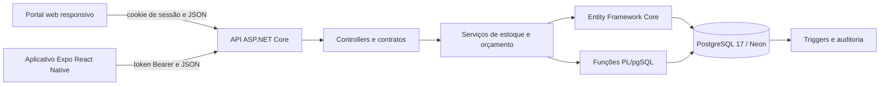
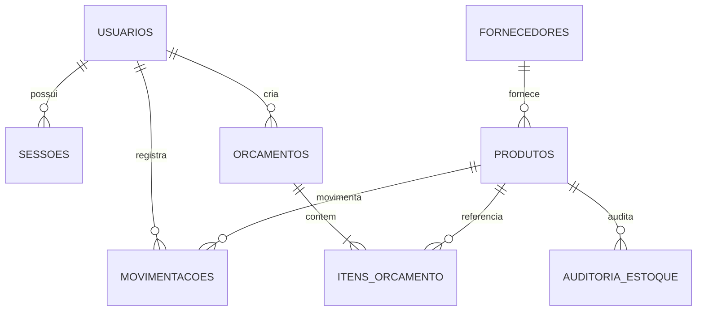

# Arquitetura e banco de dados do TechPaper

## Componentes

O portal e o aplicativo não calculam saldos nem totais definitivos. A API valida identidade e permissões. O serviço de orçamento consulta preços atuais e calcula subtotais e total. O serviço de estoque chama uma função PL/pgSQL que bloqueia o produto durante a alteração, associa o usuário autenticado e reconhece tentativas repetidas pela chave da operação.

## Modelo entidade relacionamento

## Entidades principais

| Entidade | Chave e relacionamentos | Regras principais |
|---|---|---|
| Usuários | `Id`; sessões, movimentações e orçamentos | Login único, perfil válido, conta ativa, senha em hash |
| Fornecedores | `Id`; produtos | CNPJ único e prazo não negativo |
| Produtos | `Id`; fornecedor, movimentos, itens e auditoria | SKU único, preços e estoque não negativos |
| Movimentações | `Id`; produto e responsável | Quantidade positiva, entrada/saída, chave de operação única, histórico imutável |
| Orçamentos | `Id`; autor e itens | Rascunho/aprovado/cancelado, total não negativo, versão para concorrência |
| Itens | `Id`; orçamento e produto | Produto único por orçamento, quantidade positiva, subtotal consistente |
| Sessões | hash do token; usuário | Expiração e revogação no logout ou mudança administrativa |
| Auditoria | `Id`; referência lógica ao produto | Registra saldo anterior e saldo atual após cada alteração |

## Funções e triggers

- `sp_registrar_movimentacao`: valida a operação, bloqueia o saldo durante a transação, impede estoque negativo, grava identidade e torna a repetição segura.
- `sp_resumo_estoque`: apresenta produtos abaixo de um limite para reposição.
- `tr_produto_auditoria`: registra toda mudança de saldo.
- `tr_movimento_sem_edicao` e `tr_movimento_sem_exclusao`: preservam o histórico de estoque.

Os índices cobrem busca por nome/categoria, produtos com baixo estoque, histórico por produto e data, sessões expiradas e orçamentos por estado/data. O arquivo `004_verificacao.sql` inclui uma consulta de coerência entre saldo e histórico e um `EXPLAIN` para demonstrar o índice do histórico.
