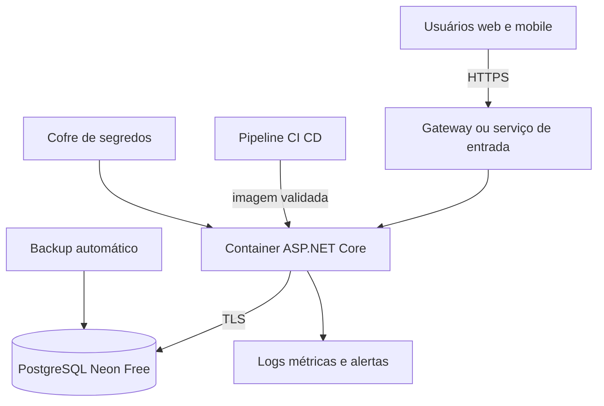

# Plano de nuvem DevOps e sprints

## Implantação proposta

A arquitetura de referência utiliza Render Free para o container da API e do portal, PostgreSQL na Neon Free, variáveis secretas, HTTPS e métricas dos dois serviços. O aplicativo móvel acessa apenas a URL HTTPS pública da API. A conexão com o banco exige TLS e fica guardada na Render.

Foram escolhidos Render Free para a API e Neon Free para o PostgreSQL. Em 6 de setembro de 2026, as duas páginas oficiais informavam custo de US$ 0 e permitiam iniciar sem cartão. A Render suspende a API após 15 minutos sem tráfego; a Neon reduz a computação quando o banco fica ocioso. Essas limitações são aceitáveis para protótipo acadêmico e devem aparecer no relatório. O roteiro está em `FINALIZACAO_ANDROID_E_NUVEM.md`.

## Controles operacionais

- Construir uma imagem imutável da API a partir do Dockerfile.
- Executar a estrutura do banco de forma controlada antes da nova versão da aplicação.
- Guardar conexão e credenciais no cofre do provedor, fora do repositório.
- Exigir TLS na conexão externa entre Render e Neon e manter a string como segredo.
- Usar `/health` para disponibilidade e `/health/ready` para prontidão com o banco.
- Coletar taxa de erros, duração das requisições, uso de CPU/memória, conexões do banco e falhas de login sem registrar senhas ou tokens.
- Alertar a equipe após falhas repetidas, indisponibilidade ou uso próximo do limite contratado.
- Fazer backups automáticos e um teste de restauração antes da entrega.
- Definir retenção mínima dos registros de movimentação e auditoria conforme a necessidade da organização.
- Escalar horizontalmente a API somente após teste de carga; manter o banco como serviço compartilhado.

O arquivo `.github/workflows/validar.yml` executa compilação, banco descartável, testes de integração, testes mobile, verificação das dependências Expo e exportação Android. A publicação no provedor deve ser acrescentada apenas depois que a equipe escolher o ambiente e criar os segredos de implantação.

## Product Backlog da programação

| ID | Prioridade | História | Aceite |
|---|---|---|---|
| PIM4-01 | Alta | Como funcionário, quero entrar com segurança | Sessão revogável, senha em hash e nenhuma senha na resposta |
| PIM4-02 | Alta | Como gestor, quero controlar permissões | API rejeita operações fora do perfil |
| PIM4-03 | Alta | Como funcionário, quero consultar produtos no celular | Busca mostra os mesmos dados do portal |
| PIM4-04 | Alta | Como funcionário, quero movimentar estoque | Saldo e histórico são atualizados juntos; repetição não duplica |
| PIM4-05 | Alta | Como funcionário, quero criar orçamentos | Servidor confirma itens, preços e total |
| PIM4-06 | Alta | Como supervisor, quero aprovar orçamentos | Apenas perfis autorizados alteram o estado atual |
| PIM4-07 | Alta | Como equipe, quero um banco reproduzível | Scripts criam tabelas, índices, funções e triggers em banco vazio |
| PIM4-08 | Média | Como gestor, quero relatórios | Filtros, CSV e impressão/PDF correspondem aos dados exibidos |
| PIM4-09 | Média | Como equipe técnica, quero implantação monitorada | Container, pipeline, saúde, backup, logs e alertas documentados |
| PIM4-10 | Alta | Como usuário, quero acesso inclusivo | Fluxos principais funcionam com teclado, leitor de tela e ampliação após avaliação |

## Cronograma até novembro

As datas abaixo são marcos sugeridos e podem ser ajustadas ao calendário da turma.

| Período | Objetivo | Saída |
|---|---|---|
| 7 a 20 de setembro | Validar a base com a equipe | Regras de orçamento, perfis e requisitos aceitos |
| 21 de setembro a 4 de outubro | Rodar web, API e banco nos computadores do grupo | Ambiente reproduzível e correções locais |
| 5 a 18 de outubro | Rodar o aplicativo em aparelho Android | Capturas das telas e sincronização web/mobile |
| 19 a 31 de outubro | Acessibilidade, testes e nuvem | Evidências, resultados e decisão de hospedagem |
| 1 a 10 de novembro | Integrar ao relatório | Texto, figuras, tabelas, scripts e referências revisados |
| Depois de 10 de novembro | Margem de segurança | Correções da orientação e ensaio da apresentação |

## Kanban inicial

| Concluído na base | Validar com a equipe | Produzir no ambiente final |
|---|---|---|
| API protegida; PostgreSQL; funções; triggers; portal; código mobile; testes; containers; pipeline; Render/Neon escolhidos; perfis APK/AAB | Regra de baixa do orçamento; perfis; campos do cliente; datas do calendário | Contas Render/Neon/Expo; execução em celulares; capturas; teste de acessibilidade; teste de restauração; implantação; texto acadêmico |
